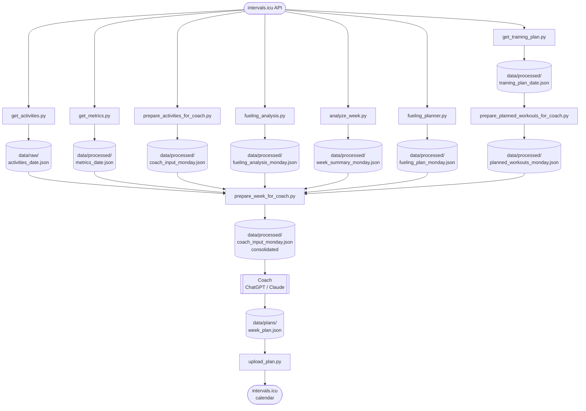

# Intervals.icu Tools

A Python project and **MCP server** for fetching, analyzing, and exporting cycling training data from [intervals.icu](https://intervals.icu) — and for uploading AI-generated training plans back to the calendar. The project includes ready-to-use **system prompts** and a **coaching logic library** with domain knowledge based on Joe Friel's training principles, so you can connect your AI assistant and start coaching conversations immediately.

## Description

`intervals-icu-sync` provides two ways to work with your intervals.icu training data:

- **Local Python scripts** — run directly on your machine, exchange JSON files with your AI coach manually
- **Publicly hosted MCP server** at [intervals-mcp.training-architect.com](https://intervals-mcp.training-architect.com) — connect Claude, ChatGPT, or Microsoft Copilot directly, no local setup required

Both expose the same coaching workflow:

- Fetch raw activity and wellness data from intervals.icu
- Analyze training quality per week using Joe Friel principles
- Export simplified summaries for an AI coach
- Evaluate carbohydrate fueling quality per session
- Track performance metrics (FTP, VO2Max, CTL/ATL, HRV)
- Upload planned rides generated by the AI coach back to intervals.icu

## Prerequisites

For the analysis to work properly, the following conditions should be met:

1. **Power meter data**: Activities should contain power data. Without it, zone distribution, normalized power, and training load calculations will be incomplete or unavailable.

2. **Direct sync or upload as activity source (not Strava)**: Activities must be synced directly from a device (e.g. Garmin Connect, Wahoo, Zwift) or uploaded manually — not via Strava. The intervals.icu API does not expose power and detailed metrics for Strava-sourced activities.

3. **Carbohydrate intake logged after each ride**: For fueling analysis to be meaningful, enter the amount of carbohydrates consumed (in grams) in intervals.icu after each session. This is the basis for the fueling ratio and coaching recommendations.

4. **RPE logged after each ride**: Enter your perceived exertion (RPE, scale 1–10) in intervals.icu after each session. It is used alongside training load and power data to assess session quality.

5. **Optional but very helpful**: Use the description in "Notes" after a ride to comment on your training given the "AI Coach" more context.

6. **Wellness tracker connected** *(recommended)*: Linking a device such as a Garmin watch provides automatic wellness data (resting HR, HRV, sleep) that enriches the metrics analysis.

7. **Body weight maintained in intervals.icu**: Keep your weight up to date in intervals.icu so that calculated metrics like VO2Max are accurate.

8. **Activity tags set in intervals.icu** *(recommended)*: Tag your completed activities in intervals.icu using the tag scheme described in the [Coaching Logic](#coaching-logic) section (e.g. `vo2max-high`, `lactate-treshold-moderate`). Tags take priority over automatic session classification and lead to more accurate coaching output.

9. **Training plan created in intervals.icu using the Target Generator** *(recommended)*: Create a training plan in intervals.icu via the **Target Generator** (Plans → Target Generator). This places PLAN events (mesocycle blocks, e.g. Base / Build / Peak) and TARGET events (weekly TSS targets) in your calendar. `get_training_plan.py` reads these events and adds the current phase name and weekly load target — as well as the following week's target — to the coach input. Without a plan the training plan section will be empty.

## Coaching Logic

The coaching system is split across two directories:

**`prompts/system_prompt.md`** — The base system prompt for the LLM (ChatGPT, Claude, etc.). It contains a placeholder block:

```
## Athlete Profile

<<INSERT ATHLETE / DISCIPLINE BLOCK HERE>>
```

Before passing the prompt to the coach, copy the contents of the matching `discipline_*.md` file into that block:

| File | Athlete type |
|---|---|
| `discipline_climber.md` | Climber / FTP-focused athlete |
| `discipline_criterium.md` | Criterium racer / W\' and repeatability focus |
| `discipline_roadrace.md` | Road racer / aerobic durability and FTP focus |
| `discipline_marathon.md` | Mountain marathon (L'Etape du Tour, Ötztaler) / ultra-long endurance focus |

This keeps the base prompt stable while allowing the athlete profile to be swapped out per use.

**`coach-logic/`** — Modular documentation of the coaching domain knowledge:

| File | Content |
|---|---|
| `training_philosophy.md` | Underlying training principles based on Joe Friel |
| `coach_logic.md` | Coaching logic, data interpretation and decision framework |
| `decision_enginde.md` | How the coach makes training decisions based on input data |
| `fueling_rules.md` | Fueling evaluation rules and their coaching impact |
| `training_zones.md` | Power, HR and RPE zone definitions used by the coach |
| `input_schema.md` | Description of the JSON input schema passed to the coach |
| `workouts.md` | Example workouts for key training domains (VO2max, threshold, endurance etc.) with dose levels and tags |

The combination of:
- structured data (intervals.icu)
- domain-specific prompt (`prompts/system_prompt.md`)
- LLM reasoning

creates a lightweight but powerful coaching system. The full system prompt is maintained in [`prompts/system_prompt.md`](prompts/system_prompt.md).

## How to Use

The tools in this project can be used in three different ways, depending on your technical comfort level and setup preferences.

---

### Option 1 – "Bits-and-Bytes" (Local scripts + manual file exchange)

Run the Python scripts locally and exchange JSON files with your AI coaching tool manually.

**What you do each week:**

1. Run `prepare_week_for_coach.py` to pull all data from intervals.icu and produce a single coaching input file.
2. Upload or paste that file into your AI assistant (ChatGPT, Claude, etc.) along with the system prompt.
3. Discuss the week with your coach, receive a JSON training plan, save it locally.
4. Run `upload_plan.py` to push the plan to intervals.icu.

**Best for:** Users who want full control, prefer no external dependencies, or want to understand the tooling in detail.

**Details:** See [Setup](#setup), [Data Flow](#data-flow) and [Scripts](#scripts) further below.

---

### Option 2 – "Managed" (Public MCP Server)

Use the publicly hosted MCP server at `intervals-mcp.training-architect.com`. No local Python environment required — connect your AI assistant directly to the server via the Model Context Protocol.

**What you do each week:**

1. Connect Claude or another MCP-capable AI assistant to the public server (one-time setup).
2. Authenticate with your intervals.icu Athlete ID and API Key 
3. Ask your coach to fetch your training data, analyse it, and generate a plan — all within the conversation.
4. Confirm the plan; the server uploads it directly to your intervals.icu calendar.

**Best for:** Users who prefer a managed, zero-install experience without running any local scripts.

**Step-by-step guide:** [docs/gen_ai_setup_step_by_step.md](docs/gen_ai_setup_step_by_step.md)

### Option 3 – "Integrated Web App" *(coming soon)*

A web application that combines the full coaching workflow into a single interface — no local setup, no manual file exchange.

*Details to follow.*

---

## Files
```
intervals-icu-sync/
├── scripts/                        # Runnable entry-point scripts
│   ├── get_activities.py           # Fetch activities → data/raw/
│   ├── get_metrics.py              # Fetch athlete metrics → data/processed/
│   ├── get_training_plan.py        # Fetch active training plan → data/processed/
│   ├── analyze_week.py             # Analyze current calendar week (Joe Friel)
│   ├── prepare_activities_for_coach.py  # Export simplified JSON for coach/ChatGPT
│   ├── prepare_planned_workouts_for_coach.py  # Format planned workouts → data/processed/
│   ├── fueling_analysis.py         # Analyze carbohydrate fueling quality
│   ├── fueling_planner.py          # Generate carbohydrate targets per session
│   ├── upload_plan.py              # Upload JSON training plan to intervals.icu
│   ├── wbal_analysis.py            # Compute W'bal time series from power stream
│   ├── prepare_week_for_coach.py   # Run all scripts in sequence
│   └── mcp_server.py               # FastMCP server exposing data as tools/resources
├── prompts/
│   ├── system_prompt.md            # System prompt for the AI coach (LLM instructions)
│   ├── discipline_climber.md       # Athlete profile block: climber / FTP focus
│   ├── discipline_criterium.md     # Athlete profile block: criterium / W' focus
│   ├── discipline_marathon.md      # Athlete profile block: mountain marathon / ultra-long endurance
│   └── discipline_roadrace.md      # Athlete profile block: road race / durability focus
├── coach-logic/
│   ├── training_philosophy.md      # Underlying training principles (Joe Friel)
│   ├── coach_logic.md              # Coaching logic, interpretation & decision framework
│   ├── decision_enginde.md         # Decision engine: how the coach makes training decisions
│   ├── fueling_rules.md            # Fueling evaluation rules and their coaching impact
│   ├── training_zones.md           # Power, HR and RPE zone definitions
│   ├── input_schema.md             # JSON input schema description for the AI coach
│   └── workouts.md                 # Example workouts by domain and dose level (with tags)
├── docs/
│   ├── 2026-05 Next Level intervals-icu.pdf           # Webinar slides (German)
│   ├── 2026-05 Next Level intervals-icu Step by Step.pdf  # Step-by-step setup guide (English)
│   └── webinar_notes.md            # Webinar companion guide (German)
├── notebooks/
│   └── week_summary.ipynb          # Interactive weekly training overview
├── src/
│   └── intervals_icu/
│       ├── __init__.py
│       ├── client.py               # HTTP client (intervals.icu API)
│       ├── config.py               # Loads API_KEY, ATHLETE_ID from .env
│       └── wbal.py                 # Shared W'bal computation (Skiba differential model)
├── data/
│   ├── raw/                        # Raw API responses (git-ignored)
│   ├── processed/                  # Derived JSON exports (git-ignored)
│   └── plans/                      # Training plan JSON files
├── tests/
│   └── test_upload_plan_regressions.py  # Regression tests for upload_plan.py and ZWO generation
├── .env.example
├── .pre-commit-config.yaml       # Git hook config (strips Jupyter outputs before commit)
├── CHANGELOG.md                  # Project change history (Keep a Changelog format)
├── requirements.txt
├── VERSION                       # Current project version (SemVer)
├── start_mcp_server.ps1            # Start/stop the MCP server in SSE mode (Windows PowerShell)
├── webservice/                     # MCP server deployed as Azure App Service (see webservice/README.md)
└── README.md
```

## Setup

### 1. Create a virtual environment

```bash
python -m venv .venv
source .venv/bin/activate   # Windows: .venv\Scripts\activate
```

### 2. Install requirements

```bash
pip install -r requirements.txt
```

### 2b. Prevent Jupyter output-only commits (recommended)

Enable the notebook output stripping hook:

```bash
pre-commit install
```

This project includes `.pre-commit-config.yaml` with `nbstripout`, so notebook output and execution-count-only changes are removed automatically at commit time.

### 3. Set your API key

```bash
cp .env.example .env
# Edit .env and set API_KEY and ATHLETE_ID
```

- **API_KEY**: found in intervals.icu under **Settings → Developer Settings**
- **ATHLETE_ID**: your athlete ID, also under **Settings → Developer Settings**

> **Only needed if you use the MCP server with a Cloudflare tunnel (or other reverse proxy):**
>
> ```
> FASTMCP_ALLOWED_HOST=your-tunnel-hostname.example.com
> ```
>
> Set this to the public hostname of your tunnel (e.g. `intervals-icu-mcp-local.my-brands.com`).
> The MCP server uses it to accept incoming requests that carry that `Host` header.
> Leave it unset if you only run the MCP server locally (no tunnel).

## Versioning and Releases

This project follows [Semantic Versioning](https://semver.org/).

- Current version source: `VERSION`
- Change history: `CHANGELOG.md`
- Release artifacts: Git tags and GitHub Releases

### Release process

1. Add upcoming changes under `## [Unreleased]` in `CHANGELOG.md`.
2. Bump `VERSION` to the new release version.
3. Move release-ready entries from `Unreleased` to a dated `## [x.y.z] - YYYY-MM-DD` section.
4. Commit the release changes.
5. Create and push the Git tag (for example `v0.1.0`).
6. Publish a GitHub Release for that tag.

## Data Flow



`prepare_week_for_coach.py` runs all scripts above in order and then consolidates the results (metrics, week summary, activities, fueling analysis, planned workouts) into a single `coach_input_{monday}.json`.

That means: Run
```
python ./scripts/prepare_week_for_coach.py
```
to get the current version of 
```
data/processed/coach_input_{monday}.json
```
for the week. Share this file with your "coach" (ChatGPT, Claude etc ...) and discuss the outcome and the plan for the week.

Ask your "coach" to create a plan for the week as JSON file. The format of the JSON is described in the system prompt above. Copy this JSON into `data/plan/week_plan.json` and run 
```
python ./scripts/upload_plan.py
```
to upload the plan to intervals.icu

## Scripts

### `get_activities.py`

Fetches cycling activities from intervals.icu (Monday of previous week → today) and saves them to `data/raw/`.
Included activity types are `Ride`, `MountainBikeRide`, and `GravelRide` (plus `VirtualRide` for indoor/platform rides).

```bash
python scripts/get_activities.py
```

Output: `data/raw/activities_{date}.json`

---

### `get_metrics.py`

Fetches athlete performance metrics: FTP, eFTP, W', weight, CTL, ATL, resting HR, HRV, best 5-minute power, and calculated VO2Max.

```bash
python scripts/get_metrics.py
```

Output: `data/processed/metrics_{date}.json`

---

### `analyze_week.py`

Analyzes the current calendar week (Mon–Sun) using Joe Friel training principles. Classifies sessions (VO2max / Threshold / Endurance), computes aerobic decoupling, and prints a coaching interpretation.

Also computes **Form %** based on CTL (fitness) and ATL (fatigue):

- `form_absolute = CTL − ATL`
- `form_pct = (CTL − ATL) / CTL` — relative to current fitness level
- Form zones: `fresh` (> 0%) · `transition` (0 to −10%) · `optimal` (−10 to −30%) · `high_risk` (< −30%)
- Coaching recommendations adapt based on form zone (combined with HRV if available)

```bash
python scripts/analyze_week.py
```

Output: console + `data/processed/week_summary_{monday}.json`

---

### `prepare_activities_for_coach.py`

Exports a simplified JSON of this week's rides for sharing with a coach or ChatGPT. Includes duration, training load, power, RPE, interval summary, decoupling, and carbohydrate intake.
Activities in the exported list are sorted by date/time with the newest ride first.

```bash
python scripts/prepare_activities_for_coach.py
```

Output: `data/processed/coach_input_{monday}.json`

---

### `fueling_analysis.py`

Analyzes carbohydrate fueling quality per activity and for the week. Classifies fueling based on duration (no fueling needed / optional / required), computes carbs/h and fueling ratio, detects underfueled sessions, and generates coaching recommendations.

```bash
python scripts/fueling_analysis.py
```

Output: console report + `data/processed/fueling_analysis_{monday}.json`

---

### `fueling_planner.py`

Generates per-session carbohydrate intake targets based on ride type, duration, and current fatigue (Form %).
Reads from `coach_input_{monday}.json` (specifically the `fueling_analysis.activities` list, which already carries `ride_type`).

Target ranges by ride type:

| Ride Type | Target (g/h) |
|---|---|
| Long Ride | 80–90 |
| Threshold | 50–70 |
| VO2max | 40–60 |
| Endurance ≥ 2 h | 60–80 |
| Endurance < 2 h | 30–50 |
| Recovery | 0–30 |

When Form % < −20% (high fatigue), targets are raised by **+10 g/h** to offset elevated carbohydrate demand.

For each session the plan includes target g/h, total grams, and a practical strategy (gels, bottles, solid food).

```bash
python scripts/fueling_planner.py
```

Output: console plan + `data/processed/fueling_plan_{monday}.json`

---

### `prepare_planned_workouts_for_coach.py`

Reads the most recent `training_plan_*.json` and extracts the planned workouts for the current and next ISO week. Simplifies each workout to the fields relevant for coaching (date, name, type, duration, planned load, description, zone distribution, step structure) and saves the result.

```bash
python scripts/prepare_planned_workouts_for_coach.py
```

Output: `data/processed/planned_workouts_{monday}.json`

---

### `prepare_week_for_coach.py`

Runs all scripts in the correct order:
`get_activities.py` → `get_metrics.py` → `get_training_plan.py` → `prepare_activities_for_coach.py` → `prepare_planned_workouts_for_coach.py` → `fueling_analysis.py` → `analyze_week.py`

Aborts immediately if any script fails.

```bash
python scripts/prepare_week_for_coach.py
```

---

### `get_training_plan.py`

Fetches the athlete's currently active training plan from intervals.icu (if one is assigned). Prints a short summary (plan name, start date, duration, number of workouts) and saves the raw API response.

```bash
python scripts/get_training_plan.py
```

Output: `data/processed/training_plan_{date}.json`

---

### `wbal_analysis.py`

Fetches the power stream for one or more activities from intervals.icu and computes the W'bal (anaerobic energy reserve) time series using the **Skiba differential model**:

- **Depletion** (P ≥ CP): W'bal decreases by `P − CP` joules per second
- **Reconstitution** (P < CP): `W'bal += (W' − W'bal) × (1 − e^(−1/τ))` where `τ = W' / (CP − P̄_sub_cp)`
- W' and CP are read from `icu_w_prime` and `icu_ftp` in the raw activity data

Per-activity output includes:

| Field | Description |
|---|---|
| `wbal_min_j` | Minimum W'bal reached (joules) |
| `wbal_usage_pct` | Maximum depletion as % of W' |
| `seconds_below_30pct` | Seconds with W'bal < 30 % of W' |
| `seconds_below_10pct` | Seconds with W'bal < 10 % of W' |
| `wbal_depletion_events` | Number of times W'bal drops below 40 % and recovers above 50 % |
| `wbal_recovery_ratio` | Average ratio of W' recovered vs. W' depleted per event (0–1, `null` if no events) |

Plus the full second-by-second W'bal series.

```bash
# All qualifying rides from the latest raw activities file
python scripts/wbal_analysis.py

# Single activity by id
python scripts/wbal_analysis.py --id i143131711

# Show a matplotlib plot (requires matplotlib)
python scripts/wbal_analysis.py --id i143131711 --plot
```

Output: `data/processed/wbal_{activity_id}.json`

---

### `mcp_server.py`

FastMCP server that exposes the training data pipeline and plan upload as MCP tools. It also offers a compact latest-activities method for clients that truncate large tool outputs. Allows AI assistants to fetch, analyse, and discuss training data without any manual file copying. See [MCP Server Integration](#mcp-server-integration) for setup and usage.

---

### `upload_plan.py`

Uploads a JSON training plan to intervals.icu as planned WORKOUT events.

Reads from `data/plans/week_plan.json` by default (or any path passed via `--plan`). The plan file is git-ignored; the `data/plans/` folder is tracked via a `.gitkeep` file.

Each entry in the JSON file must have:
- `date` — ISO 8601 datetime string, e.g. `"2026-04-12T09:00:00"`
- `name` — display name shown in intervals.icu
- `duration_minutes` — planned duration (integer or float)

Optional per entry: `description` (free-text notes), `tags` (list of tag strings, e.g. `["vo2max-moderate"]`), `steps` (structured workout intervals → uploaded as a ZWO file).

Duplicate handling: before creating events, the script fetches existing WORKOUT events for the date range and indexes them by `(name, date)`. If a match is found the existing event is updated (`PUT`); otherwise a new event is created (`POST`). Re-running the script is safe and will never produce duplicates.

```bash
# Preview without making API calls
python scripts/upload_plan.py --dry-run

# Upload the default plan
python scripts/upload_plan.py

# Upload a custom plan file
python scripts/upload_plan.py --plan data/plans/my_plan.json

# Delete all WORKOUT events for the date range, then re-upload
python scripts/upload_plan.py --clear
```

Output: one `Created` or `Updated` line per workout, summary of counts.

---


## Notebook

### `notebooks/week_summary.ipynb`

Interactive Jupyter notebook that loads the consolidated `coach_input_{monday}.json` and displays a structured overview of the current training week:

- **Athlete Metrics**: FTP, eFTP, VO2Max, W\', CTL/ATL, HRV, weight — FTP values shown in W and W/kg
- **Week Summary**: total load, time, ride count, session types (VO2 / Threshold / Endurance), aerobic decoupling
- **Form & Fatigue Analysis**: CTL, ATL, Form (absolute and % relative to fitness), Form Zone, HRV — with coaching interpretation based on form zone
- **Activities Table**: per-ride details including power, RPE, zone distribution, decoupling, and carbohydrate data
- **Zone Distribution Chart**: bar charts per activity showing Z1+2 / Z3+4 / Z5+ split
- **Integrated Fatigue & Fueling Analysis**: combines Form % and weekly fueling quality into a single coaching interpretation with recommendation
- **Fueling Analysis**: per-ride fueling status, carbs/h, fueling ratio, and weekly recommendations

Run `prepare_week_for_coach.py` first to generate the input file, then open the notebook:

```bash
python scripts/prepare_week_for_coach.py
jupyter lab notebooks/week_summary.ipynb
```

---

## Docs

### `docs/2026-05 Next Level intervals-icu.pdf`

> **Language:** German (Deutsch)

Slides of webinar *„Next Level intervals.icu – Vom Datenchaos zur Coaching-Entscheidung"* (Mai 2026).

---
### `docs/2026-05 Next Level intervals-icu Step by Step.pdf`

> **Language:** English

Step-by-step setup guide accompanying the webinar. Walks through the full installation and configuration of the intervals.icu AI coach integration — from API key setup to MCP server and ChatGPT connection.

---
### `docs/webinar_notes.md`

> **Language:** German (Deutsch)

Webinar companion guide for *„Next Level intervals.icu – Vom Datenchaos zur Coaching-Entscheidung"*.

Covers the core workflow: fetching data from intervals.icu, enriching it with the AI coach logic, generating a weekly training plan, and uploading it back to the calendar. Intended as a readable walkthrough for participants who want to understand or reproduce the setup without a live demo.

---

## Tests

Regression tests live in `tests/`. They use Python's built-in `unittest` framework and require no real credentials — `dry_run=True` prevents any API calls.

Run all tests:

```bash
python -m unittest discover -s tests -v
```

Run a specific test file:

```bash
python -m unittest tests/test_upload_plan_regressions.py -v
```

### `tests/test_upload_plan_regressions.py`

Covers regression cases for `upload_plan.py` and the ZWO generation logic:

| Test | What it checks |
|---|---|
| `test_steps_to_zwo_accepts_seconds_and_percent_fields` | `_steps_to_zwo` produces correct ZWO XML (`Duration`, `Power`) from `duration_seconds` / `power_pct_ftp` fields |
| `test_upload_plan_dry_run_supports_top_level_steps` | `upload_plan` accepts `steps` directly at the plan-entry level |
| `test_upload_plan_dry_run_supports_nested_workout_steps` | `upload_plan` accepts `steps` nested under a `workout` key |
